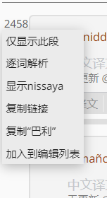

# 进阶

经文的段落编号上有弹出式菜单。

1. `仅显示此段` 页面将从新加载，仅仅显示这个段落。
1. `逐词解析` 打开[逐词解析选择窗口](../translation/wbw.md)。
1. `显示nissaya` 弹出Nissaya窗口。
1. `复制链接` 复制句子编号（如{{203-2459-2-21}}）到剪贴板。

相关阅读

[文章混合排版](../article/mix.md)