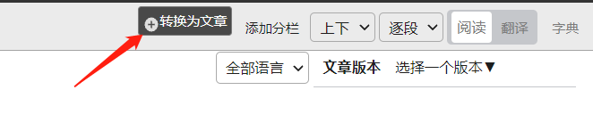

# 转换为文章

> 在阅读器中可以将经文换为可编辑的文章。您可以[插入义注复注](../article/mix.md)等更多的内容。

## 1.点击`转换为文章`按钮

## 2. 输入文章标题

## 3. 可以继续修改

>文章内容为句子模版。`{{203-2459-2-21}}`为一个句子编号。程序根据句子编号生成文章。关于[文章模版](../article/template.md)

## 进阶

- [更详细的文章编辑操作](../article/readme.md)
- [markdown格式指南](../article/markdown.md)