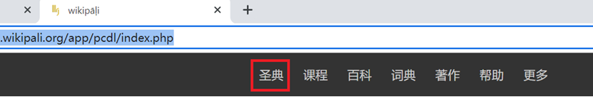
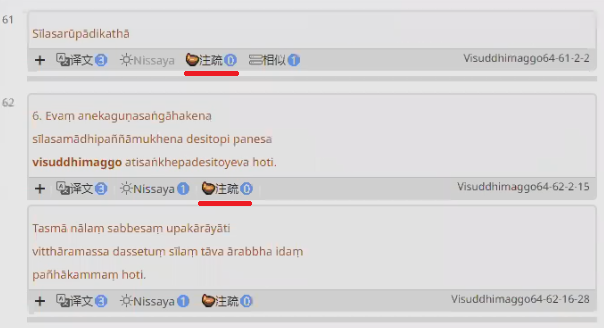
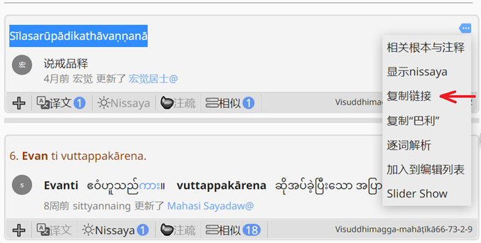
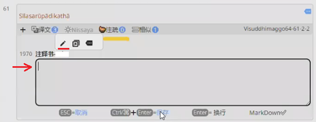
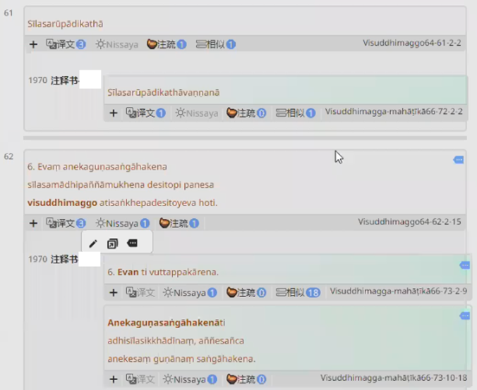
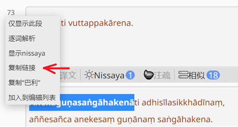

# 注释书

## 1. 建立注释书版本风格

藏经阁→译经楼
点左边一条的“版本风格”，创建一个新的版本风格，名称“注释书-自己的名字”（例如“注释书-李四”）选择“公开”，然后单击“新建”。（语言一栏不用选择）

单击新创建的“注释书-自己的名字”的版本风格后面的“编辑”，把“资源类型”改为“commentary”，然后保存。

## 2. 注释书搬砖

### 找到互相对应的原文和注释书

开两个 Chrome 浏览器，左右并排放（把其中一个浏览器使劲儿往右边拖，拖到不能再拖，它会变成只占半个屏幕的一个框，然后再选择想显示在左边的框，就可以了）

两个浏览器都打开wikipali 主页：https://www-hk.wikipali.org/app/pcdl/index.php

点最上面一横栏的“圣典”

左边的浏览器：单击“其他”，然后单击其中的《清净道论》，然后单击第一本《清净道论》，单击“Sīlaniddeso 说戒品”，然后单击第一个章节“Sīlasarūpādikathā”，点到不能再点开了，进入最后一个层级，然后单击出现的蓝色标题“Sīlasarūpādikathā”（以第一个章节为例）

右边的浏览器：单击“其他”，然后单击其中的《清净道论》，单击第一本大疏钞 Visuddhimagga-Mahāṭīkā，单击“1. Sīlaniddesavaṇṇanā”（之前左边浏览器选的标题后面加了“vaṇṇanā”，两者是对应的），然后单击右边蓝色的“Sīlasarūpādikathāvaṇṇanā”标题。

这样左边是《清净道论》原文，右边显示的是大疏钞的内容。两边都选成翻译模式。

### 搬砖

左边浏览器：左侧的目录收起来，然后在右边“贡献者”一栏中，选择刚刚新建的“注释书-自己的名字”的版本风格。

然后可以看到，《清净道论》内容中，的“注疏0” （注意：搬砖时，看一下，原文中“注疏”是0 的再搬砖，如果已经是 1了，就是有人已经搬砖了，就不用做了）

比如第一个标题“Sīlasarūpādikathā”和右边浏览器大疏钞中的“Sīlasarūpādikathāvaṇṇanā”是对应的，去复制疏钞中的句子链接（下图红色箭头处）

然后回到左边浏览器的《清净道论》，在标题中单击“注疏0”（下图黄线处），把“注疏0”点开，单击小笔的图标（下图红线处），然后在出现的框中（下图红色箭头处）粘贴刚才复制的链接（例如{{67-859-2-2}}），然后保存。

保存后会出现下图这样的原文与注释书混排的效果：

这样疏钞和原文就建立了关联。因为这个版本风格是公开的，所以全网都可以看到。

接着看下一句，右边疏钞中，有很多粗体字，粗体字来自原文，例如 Evan，来自左边原文中的 Evaṃ，下一个粗体 Anekaguṇasaṅgāhakenā来自原文中的 anekaguṇasaṅgāhakena。查找的方法是，右边疏钞中的粗体字，复制除了最后一个字母外前面的所有字母（例如Evan的 Eva），然后到原文的浏览器，Ctrl+F，然后把复制的词粘贴到搜索框，就能看到疏钞中的粗体字来自原文中的哪里了（找到的字会变成黄色）。

解释原文一段话的疏钞中的的链接，都粘贴到原文中的对应的一段话中，中间不用加标点符号。

如果需要复制疏钞中整段的链接，可以鼠标放到那一段前面的数字上，单击复制链接

疏钞中如果一个黑体字，后面有几句话都没有黑体字，那这几句话通常都是解释第一个黑体字的。只要找疏钞中的黑字体，是在原文中的哪一段就好，如果没有黑体字的疏钞中的句子，就不用找了。

注意：
1. 如果查到疏钞中的黑体字，在原文中有几段都有同样的词，选择匹配度最高的一段来搬就好。

2. 如果注释书中的黑体字在原文中找不到，则归入上一句。

3. 不用太担心注释书中的段落放错位置，但是一定要保证没有遗漏，注释书中的内容一定要全部搬到原文中，不用有缺少或遗漏的段落。不必追求对应位置的过于精准。可以大概的放，不知道放哪里的就跟着上一句放就好。

4. 关于对应位置：大原则：不要差的太远，前后顺序尽量保持一致。

