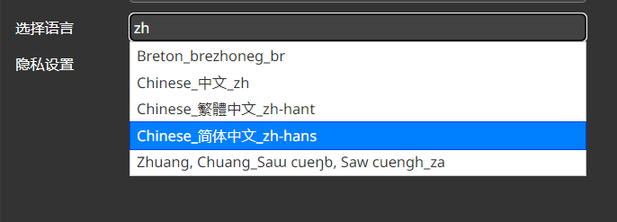
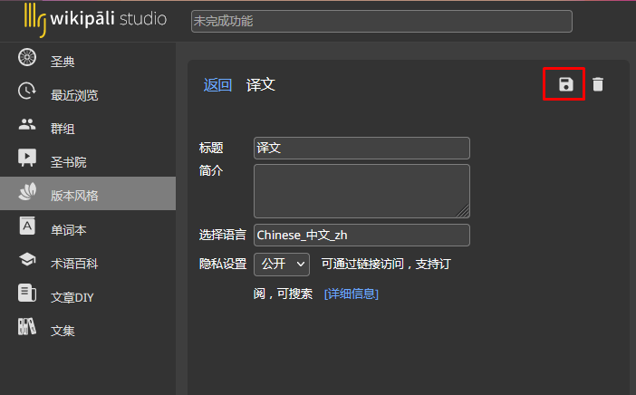

# 版本信息修改

## 1.打开修改页面
1. 进入Studio译经楼
1. 选择左侧的`版本风格`
1. 点击想要修改的版本的`修改`按钮进入修改页面

## 2.修改

### 语言

>下列方式都是被支持的
>- 输入语言缩写（en zh 等）
>- 英文全称
>- 该语言自称（中文）

### 状态

>- 停用 暂停使用，不会在译文等地方出现
>- 私享 只有您以及您授权的人才能看到
>- 公开 所有人都可以看

## 3.保存

