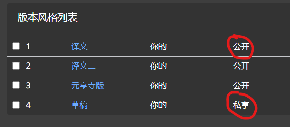

# 发布

在wikiapli,发布译文非常容易。您可以决定您的译文是否公开或是私有。您的创作过程可以是在网上。在您对作品满意后，可以公开展示。在这里，介绍的是对于个人作者的发布方法。团队协作的发布请在阅读这个指南之后，参考[团队协作](../cooperation/readme.md)。

已经公开发布的译文将在读者选择

>您应该已经了解版本的[创建](../channel/create.md)使用

## 1.使用两个版本

您可以[创建](../channel/create.md)两个版本。

一个设置为公开，另一个设置为私有。如果您已经有这两个版本，请看下一步 版本迁移

您在私有译文中翻译，校对。完成后将这些译文批量迁移到一个公开的版本。过后，当您想修改的时候，您可以修改私有版本中的译文。而不必担心不成熟的修改会被其他人看到。在您满意的时候，再次迁移到公开版本。

## 2.版本迁移

>温馨提示：您的译文所在的版本的可见性如果已经设置为公开。那么在这个版本中的所有译文成为全网可见的状态。即使是未登录用户也可以阅读。

## 相关阅读

[设置版本的公开性](../channel/public.md)

