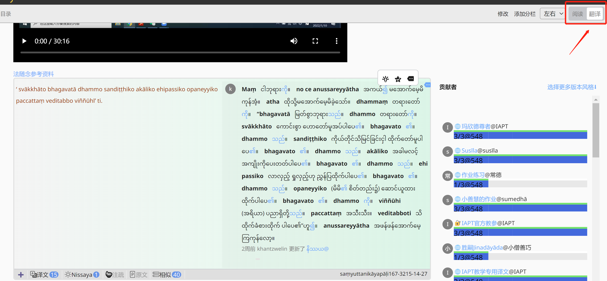
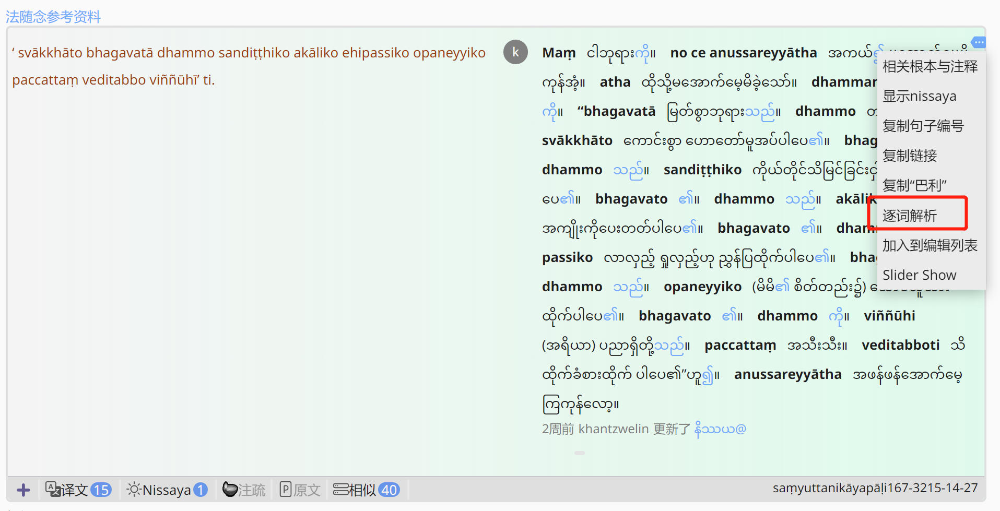
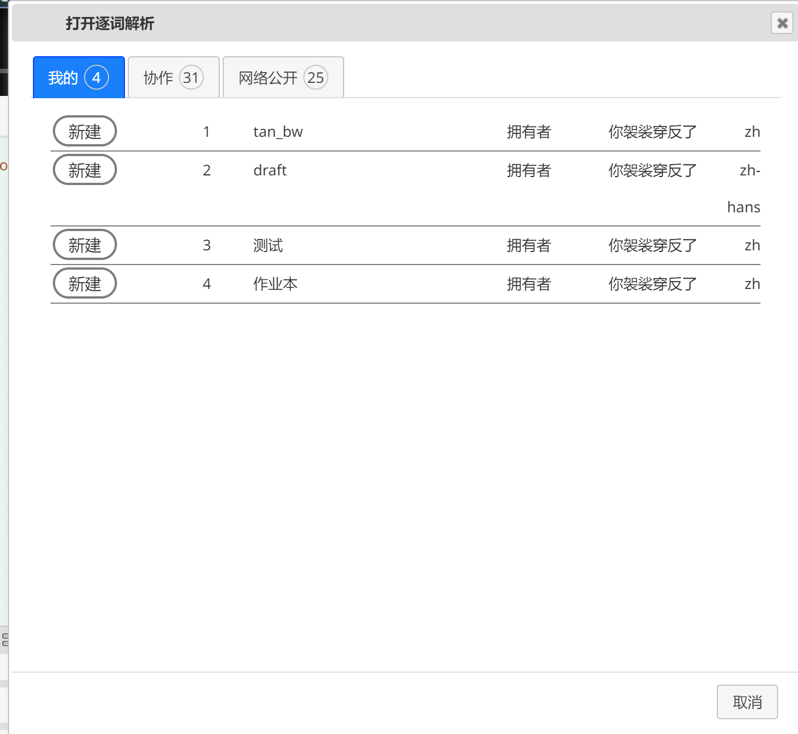
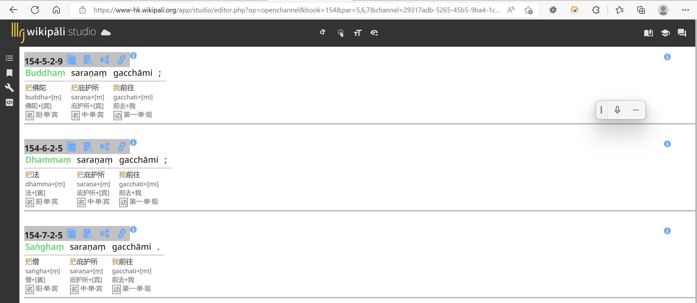
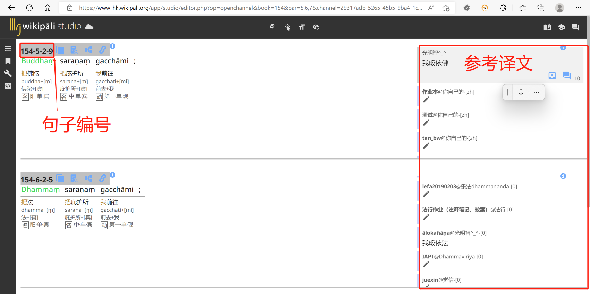

# 新建逐词解析

1.进入阅读器的 [编辑模式](../reader/mode.html)

2.在经文段落的操作菜单中，选择逐词解析

3.将这段经文的逐词解析结果置于某个版本下，点击版本名字左边的新建或编辑

4.逐词解析有逐句和逐段解析两种模式，默认是逐段模式。

如果需要参考其他的译文，需要切换到逐句模式。
逐句模式下除了可以显示参考译文，还会显示句子在三藏中的编号等信息。
把鼠标移动到参考译文的框里面上下滚动，可以看到不同版本的句子译文
