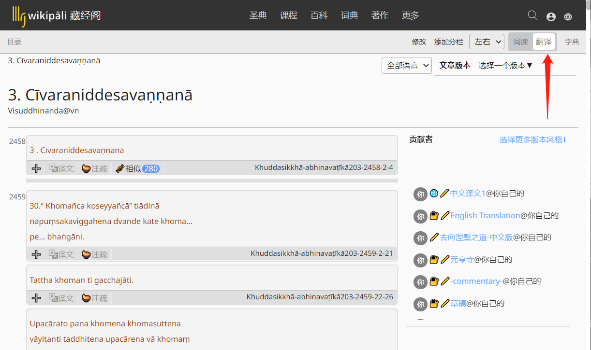
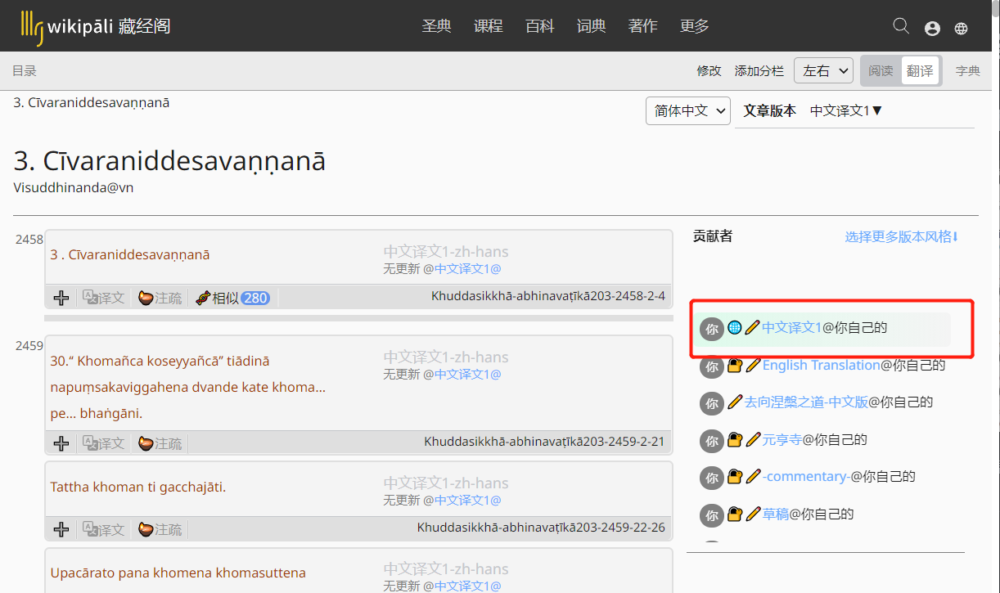
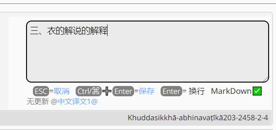
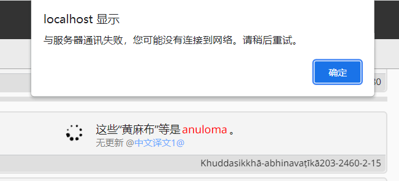

# 译文编辑

## 1. 在阅读器中点击`编辑`进入编辑模式

>温馨提示：编辑模式中只有逐句模式，没有逐段模式。

## 2.选择一个您想放置译文的版本

## 3.鼠标移至编辑区点击`编辑`按钮

## 4.输入并保存译文

>点击`保存`按钮或`Ctrl`+`Enter`保存译文。
>
>点击`取消`按钮或`Esc` 取消编辑。

**温馨提示**：当网络连接中断或非常慢时，会显示如下对话框。请稍后重试。

## 相关阅读

- [Markdown语法](markdown.md)

