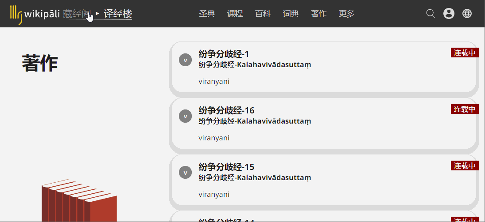

# 发布

在wikiapli,发布译文非常容易。您可以决定您的译文是否公开或是私有。您的创作过程可以是在网上。在您对作品满意后，可以公开展示。在这里，介绍的是对于个人作者的发布方法。团队协作的发布请在阅读这个指南之后，参考[团队协作](https://github.com/visuddhinanda/help.zh-hans/tree/21ce130df7991528fcb745d0364ca8b4830610ba/cooperation/readme.md)。

已经公开发布的译文将在读者选择

## 公开版本

最简单的方法是将您的译文所在的[版本](https://github.com/visuddhinanda/help.zh-hans/tree/21ce130df7991528fcb745d0364ca8b4830610ba/channel/readme.md)设置为公开。在这个版本中的所有译文成为全网可见的状态。即使是未登录用户也可以阅读。

设置译文状态的方法是：

1. 进入译经楼
2. 版本风格
3. 编辑
4. 可见性
5. 保存

您可以直接将已有的译文放到一个已经公开的版本中。保存的时候，读者就可以立即看到。

显然，对于在线翻译的用户，这种方式有一些不便。比如，您打算修改，校对完成后再公开发布。或者发现有错误的时候，仔细斟酌，修改好以后再更新译文。通常我们会在自己的个人电脑上做修改的工作，然后拷贝粘贴到网络媒体。在wikipali我们有更好的解决方案。您可以拥有完全的在线工作流程。

## 版本迁移

您可以[创建](https://github.com/visuddhinanda/help.zh-hans/tree/21ce130df7991528fcb745d0364ca8b4830610ba/channel/create.md)两个[版本](https://github.com/visuddhinanda/help.zh-hans/tree/21ce130df7991528fcb745d0364ca8b4830610ba/channel/readme.md)。

一个设置为公开，另一个设置为私有。

您在私有译文中翻译，校对。完成后将这些译文批量迁移到一个公开的版本。过后，当您想修改的时候，您可以修改私有版本中的译文。而不必担心不成熟的修改会被其他人看到。在您满意的时候，再次迁移到公开版本。

